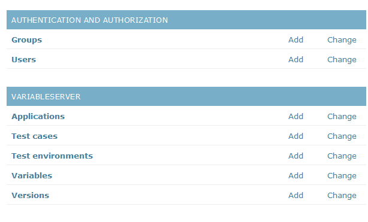
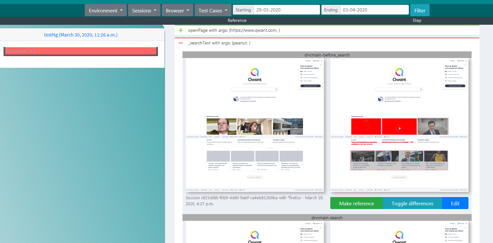

# seleniumRobot-server #
Server that supports seleniumRobot executions
Features:
- serves variables for seleniumRobot tests
- store test results if requested
- store and compare snapshots if requested

# Build #
For now, build is done through the python script `build.py`. Ite generates a zip file which you only need to unzip

# Installation #

## Windows ##
	
- Install python 3 >= 3.6)
- apache install
    - apache from apachelounge, same bitness as python
    - C++ redistributable microsoft, same version as the one used for apache compilation
    - mod_wsgi, same bitness as python

- install Postgre database (if not using a centralized database or SQLite)
- deploy files: unzip seleniumRobotServer.zip
- create virtual environment for execution: `python3 -m venv <path_to_selenium_server>/venv`
- go into virtual environment: `cd <path_to_selenium_server>/venv && Scripts\activate.bat`
- install `python-ldap` from wheel found at [https://www.lfd.uci.edu/~gohlke/pythonlibs/#python-ldap](https://www.lfd.uci.edu/~gohlke/pythonlibs/#python-ldap): `pip instal python_ldap-3.1.0-cp36-cp36m-win_amd64.whl`
- install python requirements: `pip install -r requirements.txt` 
- database migration: `python manage.py migrate`
- database fix: `python manage.py fix_permissions`
- create super user on first deploy **ONLY**: `python manage.py createsuperuser`. If using AD/LDAP, use `python manage.py ldap_promote <user>` instead
- configure Apache server (example on Windows without HTTPS)


	LoadFile "<path_to_python_dll>"
	LoadModule wsgi_module "<python_dir>/lib/site-packages/mod_wsgi/server/mod_wsgi.cp36-win32.pyd"
	WSGIPythonHome "<python_dir>"
	WSGIApplicationGroup %{GLOBAL}
	
	WSGIScriptAlias / <path_to_selenium_server>/seleniumRobotServer/wsgi.py
	WSGIPythonPath <path_to_selenium_server>
	
	<Directory "<path_to_selenium_server>/seleniumRobotServer">
		<Files wsgi.py>
			Require all granted 	
		</Files>
	</Directory>
	
	Alias /media/ <path_to_selenium_server_data>/media/
	Alias /static/ <path_to_selenium_server>/static/
	
	<Directory "<path_to_selenium_server>/static">
		Require all granted
	</Directory>
	
	<Directory "<path_to_selenium_server_data>/media">
		Require all granted
	</Directory>
	
- If HTTPS is necessary, assuming a virtualenv is created inside <path_to_selenium_server>

	WSGIPythonHome "<path_to_selenium_server>/venv"
	WSGIPythonPath <path_to_selenium_server>/venv/lib/python3.6/site-packages/:<path_to_selenium_server>
	
	<VirtualHost *:80>
	  ServerName seleniumRobotServer
	
	  RewriteEngine On
	    RewriteCond %{SERVER_PORT} !^443$
	    RewriteRule ^(.*)$ https://%{HTTP_HOST}$1 [R=308,L]
	
	</VirtualHost>
	
	<VirtualHost *:443>
		ServerName seleniumRobotServer
		LoadFile "<path_to_python>/libpython3.so"
		LoadModule wsgi_module "<path_to>/mod_rh-python36-wsgi.so"
		
		WSGIPassAuthorization On
		WSGIApplicationGroup %{GLOBAL}
		
		WSGIScriptAlias / <path_to_selenium_server>/seleniumRobotServer/wsgi.py
		
		<Directory "<path_to_selenium_server>/seleniumRobotServer">
			<Files wsgi.py>
				Require all granted
			</Files>
		</Directory>
		
		Alias /media/ <path_to_selenium_server_data>/media/
		Alias /static/ <path_to_selenium_server>/static/
		
		<Directory "<path_to_selenium_server>/static">
			Require all granted
		</Directory>
		
		<Directory "<path_to_selenium_server_data>/media">
			Require all granted
		</Directory>
	
		SSLEngine on
		SSLCertificateFile <path_to_selenium_server>/ssl/selenium-server.crt
		SSLCertificateKeyFile <path_to_selenium_server>/ssl/selenium-server.key
		SSLCACertificateFile <path_to_selenium_server>/ssl/CA_selenium-server.cer
	
	</VirtualHost>
	
    
[https://code.google.com/archive/p/modwsgi/wikis/ApplicationIssues.wiki#Python_Simplified_GIL_State_API](https://code.google.com/archive/p/modwsgi/wikis/ApplicationIssues.wiki#Python_Simplified_GIL_State_API) explains why `WSGIApplicationGroup %{GLOBAL}` is mandatory for running OpenCV inside apache server WSGI. (Else image loading hangs).

**Warning** In the above apache configuration, `<path_to_selenium_server_data>` may or may not be identical to `<path_to_selenium_server>` but MUST be the same as `${data.dir}` setting in settings.py file
    
## Linux (RHE) ##
- Install python 3 >= 3.6
- apache install (Linux): `yum install mod_wsgi httpd24-httpd`
- Install Postgre database (if not using a centralized database or SQLite)
- Install `freetype-devel`, `libpng-devel`, `gcc-c++`, `python3-devel`, `libjpeg-turbo-devel`,  `openldap-devel`,  so that dependencies can be compiled
- deploy files: unzip seleniumRobotServer.zip
- create virtual environment for execution: `python3 -m venv <path_to_selenium_server>/venv`
- go into virtual environment: `cd <path_to_selenium_server>/venv && source bin/activate`
- install python requirements: `pip install -r requirements.txt` 
- database migration: `python manage.py migrate`
- database fix: `python manage.py fix_permissions`
- create super user on first deploy **ONLY**: `python manage.py createsuperuser`. If using AD/LDAP, use `python manage.py ldap_promote <user>` instead
- configure Apache server with  


	LoadFile "/opt/rh/rh-python34/root/lib64/libpython3.so.rh-python34"
	LoadModule wsgi_module "/opt/rh/httpd24/root/usr/lib64/httpd/modules/mod_rh-python34-wsgi.so"
	WSGIPythonHome "<path_to_selenium_server>/venv"
	
	WSGIScriptAlias / <path_to_selenium_server>/seleniumRobotServer/wsgi.py
	WSGIPythonPath <path_to_selenium_server>/venv/lib/python3.4/site-packages/:<path_to_selenium_server>
	
	<Directory "<path_to_selenium_server>/seleniumRobotServer">
	<Files wsgi.py>
	Require all granted
	</Files>
	</Directory>
	
	Alias /media/ <path_to_selenium_server>/media/
	Alias /static/ <path_to_selenium_server>/static/
	
	<Directory "<path_to_selenium_server>/static">
	Require all granted
	</Directory>
	
	<Directory "<path_to_selenium_server>/media">
	Require all granted
	</Directory>


# Configuration # 

- change settings accordingly into settings.py (replace `${var}` variables)
- to use AD/LDAP authentication, uncomment `AUTHENTICATION_BACKENDS = ("seleniumRobotServer.ldapbackends.LDAPBackend1", "seleniumRobotServer.ldapbackends.LDAPBackend2", "seleniumRobotServer.ldapbackends.LDAPBackend3", 'django.contrib.auth.backends.ModelBackend',)` and configure LDAP (the example above uses 3 LDAP so you will have 3 sets of variables) values

	AUTH_LDAP_1_SERVER_URI = "ldap://my.company.com:389"
	AUTH_LDAP_1_BIND_DN = 'CN=user,OU=branch,DC=my,DC=company,DC=com'
	AUTH_LDAP_1_BIND_PASSWORD = 'pwd'
	AUTH_LDAP_1_USER_SEARCH = LDAPSearch("DC=my,DC=company,DC=com", ldap.SCOPE_SUBTREE, "(uid=%(user)s)")
	AUTH_LDAP_1_GROUP_SEARCH = LDAPSearch("DC=my,DC=company,DC=com", ldap.SCOPE_SUBTREE, "(objectClass=group)")
	AUTH_LDAP_1_GROUP_TYPE = ActiveDirectoryGroupType()
	AUTH_LDAP_1_USER_FLAGS_BY_GROUP = {
	    "is_active": (LDAPGroupQuery("CN=GROUP_USER_001,OU=Selenium,DC=my,DC=company,DC=com") |
	                  LDAPGroupQuery("CN=GROUP_ADMIN_002,OU=Selenium,DC=my,DC=company,DC=com")),
	    "is_staff": "CN=GROUP_USER_001,OU=Selenium,DC=my,DC=company,DC=com",
	    "is_superuser": "CN=GROUP_ADMIN_002,OU=Selenium,DC=my,DC=company,DC=com"
	}

- to use SQLite instead of Postgre: comment the right default database in `DATABASES`


# Usage #

## Security aspects ##

Before version 3.1, only variable server was secured, other accesses were open.
Now, you can enable/disable security on API / Web views through `SECURITY_API_ENABLED` and `SECURITY_WEB_ENABLED` parameter in settings.py.
Set it to `True` to restrict access to API / GUI

### Access with security enabled ###

As setting `SECURITY_WEB_ENABLED` and `SECURITY_API_ENABLED` to `True` will restrict all accesses, you must grant some users to access the server.

- execute `python manage.py fix_permissions` to create `Variable Users` and `Snapshot Users` groups
- If using AD/LDAP authentication or OpenID, authenticated users will automatically be added to the above groups
- Else, add them manually
- Add, as administrator an auth token to the user


- alternatively, you can create token through API (for example via Postman)


### Groups ###

#### Variable Users ####
Allow a user to add / modify variable assets, and also delete variables

#### Snapshot Users ####
Allow a user to view / add / edit snapshot comparisons

## User interface ##

### Variable Server ###
To access variable server go to `http://<server>:<port>/admin/`
Depending on your rights, you will be able to configure only variable server assets (application, test case, environment, variable and version) with `Variable Users` group or anything with admin rights



for each type of asset, behaviour is the same:

#### consult list of assets ####
Click on the asset type to access its list


#### edit asset ####
From there, click on one of the variable to modify it


#### filter list ####
Because there may be plenty of variables for your test, you can filter by application, version, environment, ...
Display will take this filter into account to reduce the number of variables displayed


It's also possible to search for some variable
**Search is done in name and value of variables**

#### add an asset ####

Clicking on `Add <asset>` allow you to create a new asset 


From there, it's also possible to add some dependencies. For example, if your variable is associated to a new TestCase, create it from this screen

##### specific to variables #####

- *reservable*: means that several variable (same name, environment, version, ...) can be defined with different values. Fro example, you have a username that cannot be used by several test scripts at the same time. So you define multiple username for that environment/application. Then, seleniumRobot reserve on of this username so it cannot be used by other tests. When test ends, this variable is released (or after 15 mins by default)
- *internal*: this variable has been created by seleniumRobot for internal use. **Do not edit**
- *protected*: value should not be displayed to non admin users or users that do not have the `Can see protected vars` right (e.g: passwords)

### Snapshot server ###

This server aims at storing test snapshots to compare them
Snapshot are sent by seleniumRobot when `seleniumRobotServerActive` and `seleniumRobotServerCompareSnapshots` are set to `true`. Moreover, only snapshot taken explicitely inside test script are sent to server

```java
capturePageSnapshot(<pic_name>, SnapshotCheckType.TRUE);
```
or

```java
captureElementSnapshot(<pic_name>, <myWebElement>, SnapshotCheckType.TRUE);
```

#### Access web interface ####

Go to [http://<server>:<port>/snapshot/](http://localhost:8002/snapshot/) and select the application / version and "compare snapshot"


#### Visualize comparison results ####

Complete "environment", "sessions", "browser", "test cases" and execution date. Each time, click on "Filter".

You will then get a list of test sessions corresponding to your search criteria.



these results will also be accessible from SeleniumRobot HTML result, as a tab in each test result, pointing to this page.

#### Edit comparison ####

For each picture, where a reference exists, a comparison pixel by pixel is done, meaning that picture size must be the same. Each pixel different from reference is coulored red. If these pixels are not relevant differences (value of a text field, picture based on news), then you can create "exclude zones" by clicking "Edit" button.

In the opened modal, draw rectangles and click "save". Differences are automatically recomputed.

On the bottom of the edit modal, you will find a table with all "exclude zones". You can disable some of them if you want them not being used anymore in comparison.


**Exclude zones** are common to all pictures that share the same reference.

**Reference**: a picture to which further snapshot taken during test will be compared. A reference is specific to an [application / version / environment / test case / test step].

#### Change reference ####

By default, the first snapshot of a [application / version / environment / test case / test step] tuple is the reference. But sometimes, while application change, inside the same version, GUI may change and so, a new reference must be set. Therefore, you can click on button  "Make reference".


In the example above, firstly, all sessions snapshot refere to "reference" snapshot. But after making "Session 2" a new reference, "Session 1" always referes to "reference" while sessions after "Session 2" refere to "Sessions 2".


## API ##

Usage is the same for all API (example for version)
- `GET http://<server>:<port>/commons/api/version/2/` => get version by id
- `POST http://<server>:<port>/commons/api/version/` => add version. Request data should contain all mandatory fields
- `PATCH http://<server>:<port>/commons/api/version/2/` => change version by id. Request data should contain only updated fields
- `PUT http://<server>:<port>/commons/api/version/2/` => change version by id. Request data should contain all fields
- `DELETE http://<server>:<port>/commons/api/version/2/` => delete the version by id

### commons ###

- `/commons/api/gversion/?name=<>`: get version by name
- `/commons/api/gapplication/?name=<>`: get application by name
- `/commons/api/genvironment/?name=<>`: get environment by name
- `/commons/api/gtestcase/?name=<>`: get test case by name
- `/commons/api/version/`: get/post version by id
- `/commons/api/application/`: get/post application by id
- `/commons/api/environment/`: get/post environment by id
- `/commons/api/testcase/`: get/post test case by id


### variables ###

#### get all variables ####

To get variables from server: `http://<server>:<port>/variable/api/variable?version=7&environment=1&test=8&format=json`

Ids can be found through user interface. 

`format=json` is mandatory so that getting variable list is not done twice, thus reserving variables twice

#### create variable ####

	POST http://<server>:<port>/variable/api/variable?name=<name>&value=<value>&reservable=<true_or_false>&environment=<env_id>&application=<app_id>&internal=<true_or_false>&timeToLive=<time_to_live_in_days>
	
- `name`: name of the variable
- `value`: value assigned to variable
- `reservable`: (optional) if true, variable will be reserved by server when getting the list. This means that during 15 minutes, it won't be usable for other test if not released
- `timeToLive`: (optional) if value is greater than 0, variable will be destroyed after N days
- `environment`: (optional) id of the environment this variable is assigned to
- `application`: (optional) id of the application this variable is assigned to
- `version`: (optional) id of the version this variable is assigned to
- `test`: (optional) id of the test case this variable is assigned to
- `internal`: (optional) true or false. If true, indicates that this variable has been created by test scenarios for reuse only. These are not test datav
#### get only old variable ####

It's possible to get variables older than X days using olderThan parameter:

	GET http://<server>:<port>/variable/api/variable?version=7&environment=1&test=8&olderThan=2&format=json

This is useful when robot creates variables during a test, for reuse in an other one and created variable cannot be used directly. Concrete case:

- you create a user
- store this user id in variable server, but your application won't allow you to consult this user immediately (e.g: it needs some batch to be fully integrated in database)
- have a test that needs a valid user, created some days before

#### destroy temp variables automatically ####

When test creates variables, it may be useful to destroy these variables after some time to avoid a database growth.
You can set a time to live to a variable using the `destroyAfterDays` parameterng  

	


